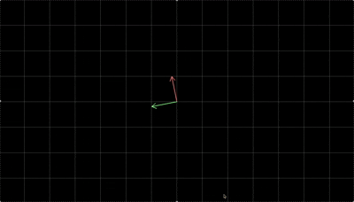

# Visualization of Linear Transformations 

## Motivation
I was inspired by the 3blue1brown youtube series about Linear Algebra. Since I am currently taking this course, I decided to strengthen my knowledge about linear transformations by making this interactive project. 

## Demo 

## Controls 
- R: resets the animation
- Space: pauses the animation
- Numbers 1 to 5 switch between matrices

## Matrices involved 
- 1: Rotation matrix 
- 2: Shear matrix 
- 3: Squeeze matrix 
- 4: Stretch matrix 
- 5: Rotation + Shear matrix